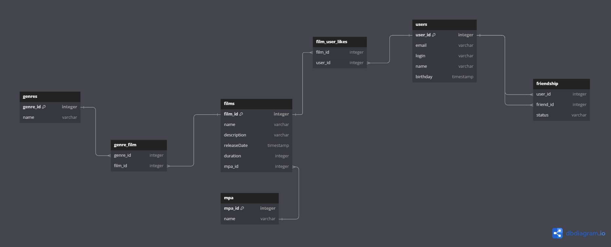

# java-filmorate

### ER-диаграмма базы данных для управления фильмами и пользователями

### Пояснение к схеме с примерами запросов для основных операций приложения.

1. Пример запроса для получения всех пользователей:

> SELECT * FROM user;

2. Получение списка друзей пользователя

> SELECT friend_id  
> FROM friendship  
> WHERE user_id = 1 AND status = 'confirmed';

3. Пример запроса для получения всех фильмов:

> SELECT * FROM film;

4. Пример запроса для получения топ фильмов по количеству:

> SELECT film_id, COUNT(user_id) AS likes  
> FROM film_user_likes  
> GROUP BY film_id  
> ORDER BY likes;

5. Пример запроса для получения всех фильмов с указанием их жанров:

> SELECT film.name, genre.name   
> FROM film   
> INNER JOIN genre_film ON film.id = genre_film.film_id   
> INNER JOIN genre ON genre_film.genre_id = genre.id;  
  в данном запросе, если у фильма несколько жанров, то мы получим таблицу с повторяющимися названиями
> фильмов+жанров

5.1 Если нам нужно вывести названия фильмов без повторов, и при этом во втором поле будет перечисления жанров в виде
списка
> SELECT film.name AS film_name, STRING_AGG(genre.name, ', ') AS genres  
> FROM film  
> JOIN genre_film ON film.id = genre_film.film_id  
> JOIN genre ON genre_film.genre_id = genre.id  
> GROUP BY film.id;

